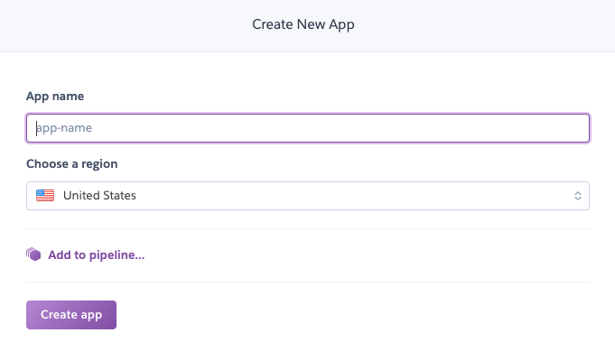
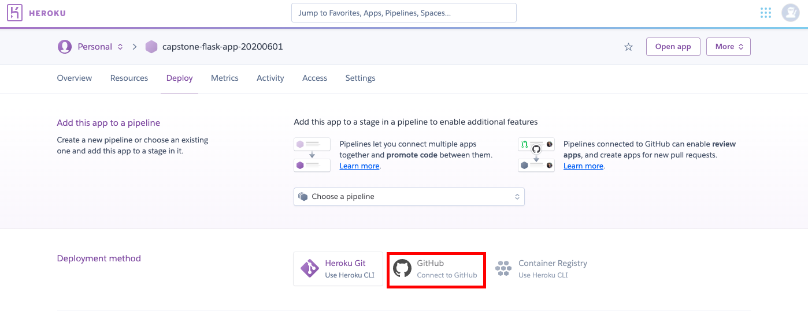
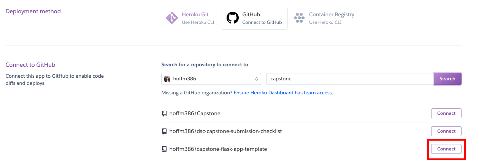
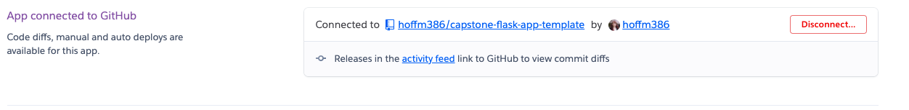
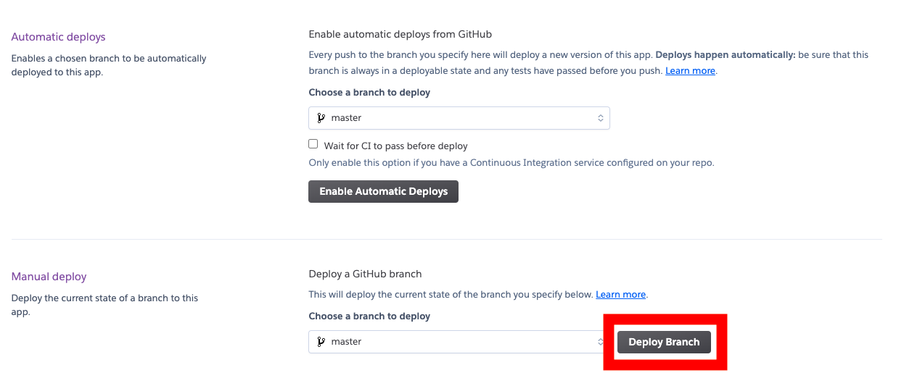
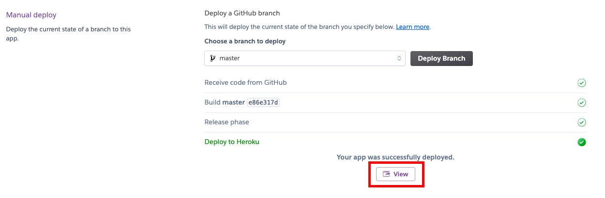

# Capstone Flask App Template

## Requirements

This repo uses Python 3.6.10. All python packages can be found in the `requirements.txt` file.  The requirements are in `pip` style, because this is supported by Heroku.

To create a new `conda` environment to use this repo, run in Bash:
```bash
conda create --name flask-env python=3.6
conda activate flask-env
pip install -r requirements.txt
# if needed, make flask-env available to you as a kernel in jupyter
python -m ipykernel install --user --name flask-env --display-name "Python 3 (flask-env)"
```

## Running the Flask Application Locally

To run in a development environment (on your local computer)
```bash
export FLASK_ENV=development
env FLASK_APP=app.py flask run
```

^^ In general, you always want to use the above instructions when working on your app, until everything is working the way you want it to.

To run in a production environment (used for deployment, but test it out locally first):
```bash
export FLASK_ENV=production
python app.py
```

^^ This is how you would run the app if deploying to a more-involved service like AWS EC2.  It's a good idea to make sure that this works, but you probably don't need to run the server this way very often.

**Regardless of whether it's in development or production mode, you can shut down the server by typing `control-C` in the terminal window where the server is running**

## Modifying the Template to Use Your Model

At minimum, you need to modify the following files:

### Model

 - Replace `src/models/iris_classifier.pickle` with your own pickled model
 - In `src/models/predictor.py`, modify the `PICKLE_PATH` variable to point to your pickled model

### View

 - Replace the features in the form in `static/index.html` with the features of your model, rather than the features of the iris dataset.  You also probably want to replace the text in the `<title>`, `<h1>`, and other tags in order to be relevant to your project rather than being [Hipster Ipsum](https://hipsum.co/)
 - Replace the features in `templates/results.html` to reflect that the results of your model, not the iris model

### Controller

- Nothing in `app.py` needs to change
- In `src/utils.py`, modify `EXPECTED_FEATURES` variable to be a list of the features of your model.  These must exactly match the `name` attributes of the `<input>` tags in `static/index.html` (same names in the same order).

### Installing Additional Packages

While the most commonly used packages are already included in `requirements.txt`, you will potentially need to install additional packages to support your deployment.  With the `flask-env` activated, you can run `pip install <package-name>`.  Once you are ready to deploy, you can generate your own `requirements.txt` for reproducibility purposes with:
```bash
pip freeze > requirements.txt
```

If your Flask app code uses a particular package and the `requirements.txt` does not list that package as a dependency, the deployment on Heroku will fail.

### Pushing Your Changes to GitHub

You can find ways online to deploy to Heroku without pushing to GitHub, but those are more complicated.  The easiest way is just:
```bash
git add .
git commit -m "updated app to include different model"
git push
```

Then Heroku will be able to clone all of your code onto its virtual computer (called a "dyno")

## Deploying to Heroku

Heroku is not the only possible deployment tool for a Flask app, but it's free and simple to use if your Flask app code is a public GitHub repository (and your pickled model is small enough to be uploaded to GitHub, i.e. < 100 MB)

**DO NOT** proceed to deploying on Heroku until the app works properly on your computer and you confirm that the modifications from the original template have been successfully pushed to GitHub.  It is much more difficult to debug software running on a cloud service than software running on your local computer!

### Creating an Account

Go to [https://signup.heroku.com/](https://signup.heroku.com/) and fill out the form to create an account.  You will likely need to click a confirmation email to finalize the account creation.

### Creating an Application

Once your account has been created and you are logged in, go to [https://dashboard.heroku.com/new-app](https://dashboard.heroku.com/new-app)



Give the app a unique name and click `Create app`.  You do **not** need to add a pipeline (this is a more sophisticated deployment tool than we need).

### Connecting to GitHub

On the following page, click the `Connect to GitHub` button (highlighted in red below)



### Selecting Your Repository

After giving Heroku permission to connect to your GitHub account, scroll down and search for a repository to connect to, then click `Connect` on the right one.  The `Connect` button is highlighted in red in the image below.  Note that you should be looking at your GitHub account and your repository name, which may not match this example exactly:

**NOTE:** You will not be able to use the original repository on `learn-co-students`.  The GitHub API will time out as it tries to look through all of those repositories.  Make sure you are using a fork of the repository on your personal GitHub.



Then it should show that the repository is connected:



### Deployment

You can enable automatic or manual deploys for your app.  In general I think that manual deploys are easier because you don't ever have to guess about the status of the live application and you don't have to configure continuous integration.

Click `Deploy Branch` (highlighted in red below)



The next step will take a bit of time.  Heroku is creating a new virtual computer, cloning your repository, installing Python and all dependencies, then launching your web server.  Keep an eye on the output in the "build" window as it goes through the steps:

 - Python app detected
 - Installing
 - Discovering process types
 - Compressing
 - Launching

### Viewing Deployed Site

If all goes according to plan, you should see a series of green checkboxes and the text `Your app was successfully deployed.`

Click the `View` button (highlighted in red below) to view your live app



The URL of the new window is the live URL of your website!  Anyone with internet access can now use your ML model.

### Heroku Troubleshooting

The first step is always to make 100% sure that your app is working locally and that you haven't forgotten to save or push any important changes.

Often we see folks forgetting to `git add` their new model pickle, or forgetting to run `pip freeze > requirements.txt` after using `pip` to install something.

Try to `git clone` another copy in a different place on your computer and see if all the files are there.  Make a new Flask environment from your `requirements.txt` and double-check that it still runs.

If you're sure that it's working locally, look at the build logs on the Heroku site.  It's possible that you have installed some package that is not available from `pip`, or are using an unsupported version of Python.  You may need several steps of modifying the `requirements.txt` file, pushing to GitHub, and re-deploying on Heroku.
